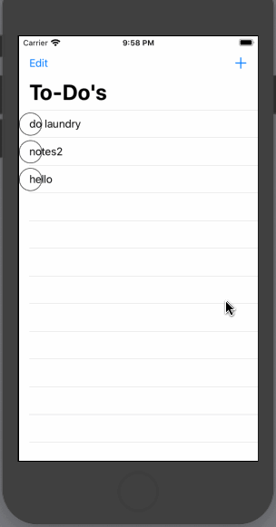

# To-Do List

List Tracker is a question-and-answer app for the Apple iPhone.

Submitted by: Raquel

Time spent: 12 hrs

## User Stories

The following **required** functionality is complete:

* [x] Display a list of items using a Table View Controller.

* [x] Add ability to add and delete items from list.

* [ ] Implement swipe-to-delete functionality.

* [x] Allow user to edit details of list item.

* [ ] Create a custom Table View Cell that allows quick updates without presenting the full editing screen.

* [ ] Add support for archiving and unarchiving list data.

The following **additional** features are implemented:

* [ ] Add the ability to share the details of an item using the Mail app.

* [ ] Add a search field at the top of the list that allows the user to filter a large list of items by specifying a portion of the item's title.

* [ ] List anything else that you can get done to improve the app functionality!

## Video Walkthrough 

Here's a walkthrough of implemented user stories:

## Notes

Describe any challenges encountered while building the app.

## License

Copyright 2020 Raquel Santos

Licensed under the Apache License, Version 2.0 (the "License");
you may not use this file except in compliance with the License.
You may obtain a copy of the License at

http://www.apache.org/licenses/LICENSE-2.0

Unless required by applicable law or agreed to in writing, software
distributed under the License is distributed on an "AS IS" BASIS,
WITHOUT WARRANTIES OR CONDITIONS OF ANY KIND, either express or implied.
See the License for the specific language governing permissions and
limitations under the License.
